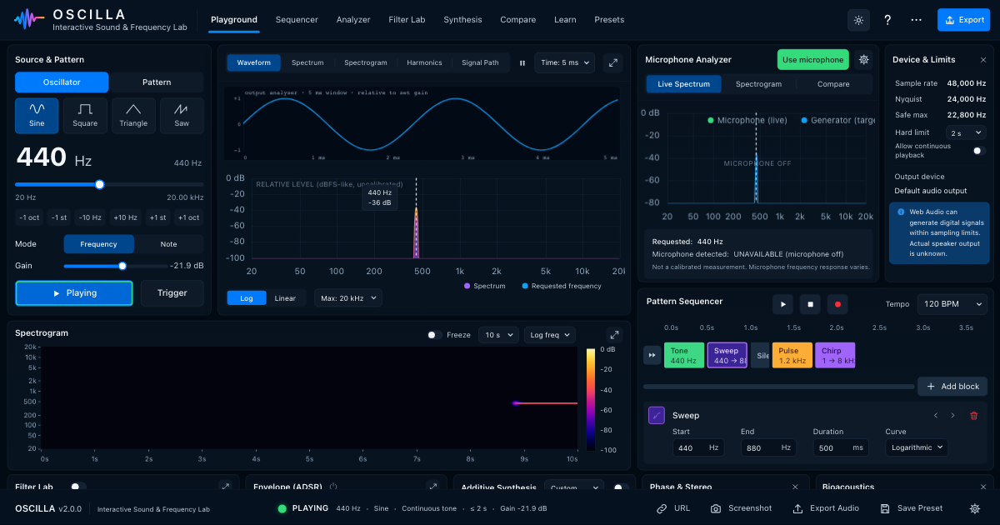

# OSCILLA

[](https://github.com/korczis/oscilla/actions/workflows/pages.yml)

An interactive sound and frequency laboratory that runs in the browser from one static file.



**Live demo:** https://korczis.github.io/oscilla/

## What it does

OSCILLA generates signals with the native Web Audio API and measures them while they play. It
shows them as a waveform, a live spectrum and a spectrogram, and it compares them with what your
microphone picks up. You can arrange signals into block sequences, shape them with filters, an
ADSR envelope and additive harmonics, explore phase and stereo, and export the result. In the
Measure workspace it records a sweep through your speaker and microphone. From that recording
it computes the response of the whole playback and capture chain, rates the quality of the
measurement and keeps it as a reproducible experiment. The app is a single HTML file. It needs no server, no account and no network once loaded, and it works
when opened straight from disk.

## The V2 laboratory

- **Generator:** sine, triangle, sawtooth and square sources, set by frequency or by note, with
  continuous and finite tone, pulse, burst, sweep up/down, ping-pong, chirp, siren, wobble, AM,
  FM, random, alternating, octave-stepping and user-defined step sequences, plus a dual
  oscillator.
- **Analyzer:** a live spectrum on log or linear frequency axes, with the requested frequency
  marked.
- **Spectrogram:** a scrolling time-frequency view, with level shown as colour.
- **Microphone analyzer and compare:** your microphone's spectrum and spectrogram, the detected
  frequency with its uncertainty, and a generator-versus-microphone comparison with freeze,
  averaging and peak hold.
- **Sequencer:** a timeline of tone, silence, sweep, pulse, chirp, burst, siren, AM, FM and
  random blocks, with drag-and-drop editing, keyboard control, looping and tempo-locked
  durations.
- **Filter Lab:** biquad filters with a response chart drawn from the browser's own filter
  response. Cutoff and Q can be dragged on the chart.
- **ADSR:** an attack/decay/sustain/release envelope with a draggable graph.
- **Additive synthesis:** a harmonic editor. The bars you see are the same coefficients that
  build the waveform you hear.
- **Phase, Lissajous and stereo:** A/B phase views, a Lissajous figure, a correlation meter and
  stereo routing (split, panned or mono).
- **Bioacoustics:** approximate hearing ranges and call examples for humans and several animal
  species, every value cited.
- **Export:** WAV of the current tone, pattern or sequence, rendered offline through the same
  signal chain as live playback; a PNG of the graphs; the configuration as JSON (export and
  import); a shareable configuration URL.
- **About:** the last workspace tells how OSCILLA was built and with what discipline, and shows
  the running build's version, commit, channel and source digest.

## The V3 measurement workbench

V3 adds two workspaces after Playground: **Measure** takes a measurement, **Experiments** keeps
and compares them. A measurement plays a known digital signal, records what comes back and
analyses the recording offline. Its result is the observed response of the whole playback and
capture chain, not of any one part of it. How to make a useful measurement is in the
[measurement guide](docs/v3/measurement-guide.md). How the layers fit together is in the
[architecture](docs/v3/architecture.md). How each result is computed, and which tests pin it,
is in the [algorithm notes](docs/v3/algorithms.md).

### Measurement Workbench

- **Guided flow.** Seven steps: input, calibration, noise check, stimulus, measure, review,
  save. One primary action moves the flow on, and an explicit state machine owns every stage
  (IDLE, PREFLIGHT, NOISE_CHECK, READY, ARMED, MEASURING, ANALYZING, then COMPLETE, INVALID,
  ABORTED or ERROR). The preset CHARACTERIZE PLAYBACK CHAIN runs a noise check and then a
  20 Hz-20 kHz log sweep, three times, at the LOW digital level. Expert settings add the sweep
  range and duration, the number of runs (1-10), mean or median aggregation, timing and phase.
- **Setup check.** Before anything plays, OSCILLA checks the microphone permission, the input
  device, the sample rate, the input level and the background noise. It requests echo
  cancellation, noise suppression and automatic gain control off, and reads back what the
  browser actually applied. A blocker stops the flow and a warning never does.
- **Input device.** The default input stays the default. Once the browser has granted the
  microphone, the Live input panel lists the inputs and you can choose one; the experiment
  records it as a hashed identifier. An input that disappears stays selected and is reported as
  not available; OSCILLA never switches microphones for you.
- **Recipe link.** "Copy recipe link" puts the measurement recipe (sweep, level, runs, timing)
  in the page address. Opening the link fills the setup and opens Measure without starting
  anything; it never carries results, calibration or a device, and an altered link is refused
  as a whole.
- **During the run.** A quality bar reports INPUT, NOISE, CLIPPING, SIGNAL and CAPTURE, and a
  screen reader hears one announcement per stage. While a measurement owns the output, the
  instrument cannot play. Escape, STOP, hiding the page or leaving the workspace aborts the
  measurement, and no audio node, capture or input track is left running.
- **Capture.** Mono PCM is recorded by an AudioWorklet loaded from a `data:` URL, so it also
  works from `file://`. When AudioWorklet is unavailable, a ScriptProcessor fallback records
  instead. The stimulus passes through the same master safety chain as every other sound, and
  that chain is part of what is measured.
- **TEST CONTEXT.** `?measure=loopback` replaces the microphone with a known synthetic digital
  system. The page then says TEST CONTEXT on the result and in every saved experiment. The
  automated tests use this mode, and it is never presented as a measurement of a physical
  system.

### Calibration

- **Frequency-response profile.** Import a microphone correction file (CSV, TXT or JSON).
  Errors are reported with their line numbers. A profile is identified by the SHA-256 of its
  points and interpolated linearly in dB over log frequency. It applies only between its first
  and last frequency: outside that range the curve stays uncorrected and is marked
  uncalibrated. The raw curve is always kept beside the CALIBRATED one. The loaded profile
  exports as CSV or JSON; both files are deterministic and import back to the same profile.
- **Absolute level calibration.** You enter an external reference (for example 94 dB SPL at
  1 kHz from a calibrator) and the relative level OSCILLA observed. This is the only way to
  get dB SPL. It is valid only for the microphone, gain, browser settings and position it was
  taken with. There is no default calibration.

### Transfer Function

The Frequency response tab shows the magnitude recovered from the captured sweep. The capture
is divided by the spectrum of the rendered sweep, with band-limited regularisation. The tab
offers:

- the raw curve, a calibrated curve where a profile covers it, smoothing (1/24 to 1/3 octave)
  and normalisation (0 dB at 1 kHz, or the mean over 500 Hz-2 kHz). Every derived view is
  labelled, and the raw curve stays visible behind it.
- a valid range, which ends where the sweep has no energy or where the signal is less than
  10 dB above the background noise. Stretches outside it are drawn dashed and faded.
- a cursor that prints frequencies no finer than the analysis resolution allows.

Phase is shown only when requested and when the alignment is robust. Otherwise it is absent,
not guessed. The magnitude is a ratio and never dB SPL.

### Impulse Response

The Impulse response tab derives the impulse response from the same sweep and the same
spectral division. Time is shown in ms from the direct peak, and the absolute offset in the
recording is kept. You can zoom to the direct sound, the early part or the whole response,
show the analysis window, and switch to a dB view normalised to the peak. Windows and
normalised views are derived objects, so the stored response never changes. The peak time
includes unknown device and browser delays: it is not a time of flight and not a latency.

### RTA

The analysis layer computes octave and one-third-octave band power on the standard base-10
band edges. Bands above 95 % of Nyquist are left out. An averager offers instant, fast and slow
time constants, peak hold and freeze. The RTA tab of the Measure workspace draws
one-third-octave band levels as bars over each band's edges, with peak hold, freeze and reset.
Levels are in dB relative (dBFS-like) unless a valid level calibration applies. No IEC 61260-1
filter class is claimed. An experiment saved from Measure does not store band levels yet: its
`results.rta` is empty, although the format, validation and CSV export already support them.

### Experiments

- **What is recorded.** Every saved measurement becomes an experiment. It records the recipe
  (stimulus, runs, analysis settings), the output level, the input device and the requested
  and applied constraints, the calibration (profile name and identity, level calibration), the
  sample rate and runs, the quality assessment and the algorithm ID of every result. It also
  records the product version and build, with a configuration hash and a result hash.
- **Repeats.** With two or more runs, the stored response is the aggregate: a power mean with
  a standard-deviation envelope, or a median with a 10th-90th percentile band, plus a
  repeatability figure in dB. The stored transfer is the aggregate's centre, marked as
  derived, never a single run.
- **The Experiments workspace.** It lists, opens, renames, duplicates, repeats (as a new
  experiment), exports and deletes experiments. It also shows an experiment in Measure.
  Export gives an `.oscilla.json` file or CSV (transfer, impulse response, aggregate) with a
  metadata header and explicit unit columns.
- **Import.** An imported file is untrusted. Oversized files, wrong types, non-finite numbers,
  unknown algorithm IDs, a future schema version and a result-hash mismatch are all refused,
  each with its reason. The file format has its own schema version, independent of the
  product version
  ([ADR 0023](.ai/repo/adrs/0023-schema-versions-independent-of-product-version.md), proposed).
- **Compare.** Comparing two or more experiments names every difference in calibration, sample
  rate, stimulus and algorithm. A minus B is shown only for equivalent experiments, and only
  over their overlapping valid range. Equivalent experiments also get an impulse-response
  overlay, each response drawn from its own direct peak on its original scale (there is no A
  minus B of impulse responses).
- **Where they are kept.** In this browser's IndexedDB only, also from `file://` (tested in
  Chromium, Firefox and WebKit, which keep an experiment across a reload). Where the database
  cannot open, experiments are kept in memory for the page view and the page says so; a full
  storage fails the save with its reason and keeps the result. The Playground never depends on
  this storage.

### Measurement quality

Every measurement is rated GOOD, USABLE, POOR or INVALID by a versioned rule set
(`oscilla.confidence.v3` for new measurements; v1 and v2 are kept so stored ratings reproduce). The rules use named metrics: signal-to-noise, clipping, dropouts,
discontinuities, frequency coverage and resolution, repeatability, and calibration. Each
rating comes with its reasons, and each reason carries its value and unit. A check that was
not made reads NOT MEASURED. Severe clipping, an empty capture, or a dropout or discontinuity
inside the sweep makes a run INVALID; milder clipping lowers the rating. Statuses are shown with text, a glyph and a shape, never colour alone. The rationale
is in the proposed [ADR 0025](.ai/repo/adrs/0025-data-driven-quality-with-reasons.md).

### Scientific limitations

- **A measurement is of the whole chain.** That chain is the browser's output, the operating
  system, the DAC and amplifier, the loudspeaker, the room, the microphone position, the
  microphone, its ADC and the browser's input path. A room measurement is not "the speaker's
  response".
- **Browsers may process the input anyway.** OSCILLA requests input processing off but cannot
  enforce it. When the applied settings cannot be confirmed, the result says so.
- **SPL needs a level calibration.** Without a valid absolute level calibration, nothing is
  labelled dB SPL. A frequency profile alone never gives SPL
  ([ADR 0017](.ai/repo/adrs/0017-relative-levels-spl-only-when-calibrated.md),
  [ADR 0020](.ai/repo/adrs/0020-calibration-semantics.md), both proposed).
- **Results come from captured PCM.** Every result is computed from captured PCM by
  deterministic offline DSP. The live analyser is feedback only
  ([ADR 0018](.ai/repo/adrs/0018-measurement-from-captured-pcm-offline-dsp.md), proposed).
  Each stored result names its algorithm by a versioned ID
  ([ADR 0024](.ai/repo/adrs/0024-versioned-algorithm-ids.md), proposed).
- **The analysis runs in a Worker.** It is one serializable task, run in a Worker started from a
  `data:` URL so that no step blocks the page; without Worker support it runs inline and yields
  between steps, with identical results (gap G21 in the algorithm notes, resolved).
- **What the tests prove.** The automated tests check the digital pipeline, the mathematics on
  synthetic systems with known answers, the browser APIs and the interface. They cannot prove
  how your hardware, room or browser behaves.
- **No medical or certification claims.** OSCILLA is not audiometry and not an IEC 61672
  sound level meter.

## The V3.1 Studio

**Studio** sits after Experiments and before About. It is a patching and composition workspace
over the same audio engine: no second engine, and the engine's master chain and limits apply.
How to use it, with the keyboard shortcuts, is the [Studio user guide](docs/v31/user-guide.md).

- **The model is the source of truth.** A Studio document is a plain, versioned `StudioModel`:
  a graph of typed nodes and ports, a timeline of tracks and clips, automation lanes, and
  transport settings. Every edit is an action with undo and redo. The audio graph is compiled
  from the model and patched in place with crossfades, so editing during playback does not
  click. Details are in [the model](docs/v31/studio-model.md), [the compiler](docs/v31/compiler.md),
  [the timeline](docs/v31/timeline.md) and
  [patches and provenance](docs/v31/patches-and-provenance.md).
- **Graph editor.** Nodes look like the Signal Path boxes, joined by cables drawn in one SVG
  layer. Port glyphs show the signal type, and only compatible ports connect. A rejected
  connection, including a feedback loop without a delay, says why in words. The editor offers:
  - pan, zoom, and frame all or the selection
  - a node library
  - dropping a cable on empty canvas to pick a compatible node
  - rectangle selection, copy, paste, duplicate and delete
  - an inspector generated from each node's parameter schema, with units; with nothing
    selected it edits the transport and document settings (tempo, time signature, loop, notes)
  - search: `/` finds a node by name, type or category and frames it
- **Timeline, transport and automation.** Tracks hold clips that you create, move, resize,
  split and delete with snapping. The timeline also has a loop region, markers, a playhead that
  follows the audio clock, and automation lanes in each parameter's own scale. STOP and Escape
  release every node and source.
- **Keyboard and touch.** Every editor has a keyboard path: a "Connect…" dialog instead of
  dragging a cable, a details panel instead of dragging a clip, and arrow-key nudges. Changes
  are announced to screen readers. On coarse pointers the targets are 44 px. Below 768 px the
  workspace splits into Graph, Timeline and Inspector views.
- **Compact widget.** The Playground shows a small signal path and clip strip of the current
  Studio document, with a button to expand it to the full workspace.
- **Templates and patches.** Start from a template, then save, open, insert, export and import
  projects and patches. An import never overwrites silently, and a hostile file is refused.
  From `file://` the browser's storage may be unavailable; the library then uses memory and
  says so.
- **Render WAV.** The Studio renders offline through the same compiler, runtime and transport
  as live playback, with progress and Abort; the same Studio renders the same bytes. A live
  input (Microphone) is refused with the reason.
- **Measurement from Studio.** In the Measurement Sweep template, PLAY hands the measurement
  clips to the Measure workspace's measurement engine: the recipe is derived from the graph and
  the clips, and the saved experiment records the Studio that ran (schema version, hash,
  execution state) beside its recipe.
- **Performance.** Responsive at about 100 nodes and 200 connections; the numbers and budgets
  are in [performance](docs/v31/performance.md).

Studio output and Playground output are exclusive: starting one stops the other, and a
measurement stops the Studio.

Not yet built:
- browser fullscreen
- deep links
- a minimap
- node groups
- dragging several clips at once
- pinch zoom on the timeline

## Safety and measurement limits

- **Start quietly, especially on headphones.** Loudness is a poor guide to acoustic output,
  above all at very low and very high frequencies. Open-ended patterns stop at a hard time
  limit unless you allow continuous playback for the session, and a limiter caps the output.
- **Levels are relative, not SPL.** Every level is relative to digital full scale (dBFS-like)
  and labelled as uncalibrated. A browser knows sample values, not sound pressure. The only
  exception is the Measure workspace with a valid absolute level calibration that you supply
  from an external reference.
- **The microphone is not calibrated.** Its response, the input processing and the room are
  unknown, so readings are only comparisons. In Measure, a frequency-response profile corrects
  the microphone only inside the profile's range. Detected frequencies are never shown with more
  precision than the analysis resolution allows.
- **Measurement sweeps start at a low digital level.** Do not wear headphones during a
  loudspeaker sweep. Small speakers can be overloaded below about 50 Hz before you hear
  anything. The [measurement guide](docs/v3/measurement-guide.md) has the details.
- **Speaker output is unknown.** Generating a frequency digitally does not mean your hardware
  reproduces it accurately, or at all.
- **Hearing ranges are approximate.** They depend on the threshold criterion and on the
  individual. Each entry cites its source (for example Heffner & Heffner 2007) and lists
  differing published values.

The reasoning is in the proposed [ADR 0017](.ai/repo/adrs/0017-relative-levels-spl-only-when-calibrated.md)
and the rule [`project.no-fake-science`](.ai/repo/rules/project/no-fake-science.v1.md).

## Architecture

```text
src/  (ES modules, plain CSS, the src/index.html shell)
  -> scripts/build.mjs              esbuild (pinned): one IIFE app bundle + one stylesheet
  -> scripts/pack-single-file.mjs   pure string assembly
  -> dist/index.html                the whole app: CSS, p5 block, app bundle, licence notices,
                                    one build-metadata region
```

- **Deterministic build.** There are no timestamps or absolute paths, so the same inputs give
  the same bytes. `npm run build:check` rebuilds in memory and fails if the committed file
  differs. `npm run verify-dist` checks the artifact statically: nothing fetched or imported
  at runtime, no module scripts, licence notices present, size budget met.
- **Vendored p5.js.** p5.js is embedded byte-for-byte from its npm package as its own
  `<script data-vendor="p5@…" data-sha256="…">` block. It is never bundled into the app code,
  and `verify-dist` checks it against the pinned package file
  ([ADR 0013](.ai/repo/adrs/0013-p5-unmodified-separable-block.md)). Alpine.js and uPlot are
  bundled; Lucide icons are inlined at build time
  ([ADR 0012](.ai/repo/adrs/0012-self-contained-runtime.md)).
- **dist/ is committed.** A clone runs without npm, every pull request shows how the artifact
  changed, and GitHub Pages serves the bytes CI checked (only the metadata region below is
  stamped) instead of running its own build.
- **Deploy-time provenance stamp.** A committed file cannot contain the hash of the commit that
  contains it. So the build writes one inline JSON region that records the version and a
  digest of the build inputs, with `commit: null`. The Pages workflow
  (`.github/workflows/pages.yml`) rewrites only that region with the deployed commit, the
  `production` channel, the commit date and the SHA-256 of the committed file
  ([ADR 0028](.ai/repo/adrs/0028-provenance-without-a-fixed-point.md)).
- **Engine and renderers.** The audio engine is the V1 engine on the native Web Audio API,
  extended through option hooks. All timing follows the audio clock
  ([ADR 0015](.ai/repo/adrs/0015-native-web-audio-engine-extended-in-place.md)). p5 draws the
  conceptual views, uPlot the quantitative charts, and custom canvas code the spectrogram and
  editors, all on one frame loop
  ([ADR 0016](.ai/repo/adrs/0016-renderer-split.md)).
- **Measurement layers.** V3 adds `src/js/measurement/`, `src/js/calibration/` and
  `src/js/experiments/`. Almost every module there is pure: plain data in, plain data out, no
  DOM and no Web Audio. Three modules are not: the engine, the browser capture adapter and the
  experiment store. The UI renders view models and computes nothing itself.
  [`docs/v3/architecture.md`](docs/v3/architecture.md) shows how stimulus, capture,
  calibration, analysis, result, quality and experiment fit together.

## Why one file?

You can double-click a single file and it works, even offline. GitHub Pages serves that same
file. The modular source exists so that the code can be tested and so that parallel work does
not collide; users never see it. See
[ADR 0011](.ai/repo/adrs/0011-modular-source-one-committed-dist.md) and the rule
[`project.single-file-deliverable`](.ai/repo/rules/project/single-file-deliverable.v2.md).

## Run locally

Double-click [`dist/index.html`](dist/index.html). No build, server or network is needed. Some
browsers refuse microphone access from `file://`. In that case the microphone panel and the
Measure setup check say so, and everything else keeps working. Where IndexedDB is unavailable
from `file://`, Experiments keeps saved experiments in memory for that page view and says so;
export them to keep them. To use the microphone locally, serve the repository on localhost and
open `dist/index.html` there:

```bash
python3 -m http.server 8000     # then open http://127.0.0.1:8000/dist/index.html
```

Or use the public URL: https://korczis.github.io/oscilla/

## Development

Requires Node.js 22 or later. The fast check also runs `majordomus doctor`, so it needs the
`majordomus` CLI.

```bash
npm ci
npm run verify          # fast: unit tests, version check, build check, artifact rules
npm run build           # src/ -> dist/index.html; commit dist/ together with the source change
npm run release-gate    # full gate, including the Playwright browser suites
npm run visual          # compare a screenshot with the visual reference at 1536x1024
```

`dist/index.html` embeds a digest of every build input (`src/`, `package.json`, the lockfile,
the build scripts), so any change to them, including a merge from `main` into a long-lived
branch, makes it stale by design: run `npm run build` and commit the result, or `build:check`
and CI fail.

The browser suites need Playwright's browsers (`npx playwright install chromium firefox
webkit`). Work lands through small pull requests. CI runs the gate on every pull request,
branch protection requires the `gate` check, and a merge to `main` redeploys Pages.

## Browser support

The release gate runs the built `dist/index.html` in Chromium, Firefox and WebKit (the engine
behind Safari) through Playwright. Each browser loads the file from `file://` and from a
GitHub-Pages-like `/oscilla/` sub-path, and the run must produce zero console errors.

## Testing

| Layer | Where | What it covers |
| --- | --- | --- |
| Unit | `tests/unit/` | Pure modules (DSP, analysis, sequencer, charts), the packer, the artifact rules and the release tooling, all under `node --test` |
| V1 freeze | `tests/freeze/` | Golden vectors that pin V1 behaviour ([ADR 0014](.ai/repo/adrs/0014-v1-behaviour-frozen-by-golden-vectors.md)) |
| Browser | `tests/browser/` | Playwright suites for the app gate, layout, V1 engine port, DSP, labs and sequencer |
| Visual | `tests/visual/` | The 1536x1024 reference and named regions, compared region by region with thresholds measured from run-to-run variance ([ADR 0029](.ai/repo/adrs/0029-visual-regression-in-the-release-gate.md)) |
| V3 unit | `tests/unit/v3-*.test.mjs` | Measurement core, transfer and impulse response on synthetic systems with known answers, RTA and aggregation, calibration, quality, experiments (schema, round trip, corrupt imports, store), goldens per algorithm ID, the engine on a fake io and the view models, all in `npm test` |
| V3 browser | `npm run test:measure` | `tests/browser/v3-measure.cjs`: the measurement engine on real Web Audio, a recovered digital loopback response, limiter transparency, 0 nodes after finish and abort. `tests/browser/v3-ui.cjs`: Measure and Experiments of the built page, guided flow, abort at every stage, calibration, experiment import, compare and export, and no "SPL" without a level calibration. Both run in Chromium, Firefox and WebKit, from `file://` and `/oscilla/` |
| V3 visual | `scripts/visual-measure.mjs`, `tests/visual/measure/` | Measure at 1536x1024 and 390x844 showing a deterministic TEST CONTEXT experiment, against the accepted reference for each environment (part of `npm run test:visual`) |

Every V3 browser check runs on a TEST CONTEXT digital loopback or a fake microphone. No
automated test proves how a physical speaker, room or microphone behaves.

`npm run release-gate` is the authority on what the gate runs and in what order.
[`tests/README.md`](tests/README.md) describes each layer and how to run it alone.

## Versioning and releases

- **One source.** The `version` field in `package.json` is the only product version
  ([ADR 0027](.ai/repo/adrs/0027-package-json-is-the-product-version-authority.md)). The
  status bar, the About dialog, the exported configuration's `oscillaVersion` and
  `window.OSCILLA.version` all derive from it at build time. `npm run version:check` fails
  when any of these disagree, or when the current version is hard-coded anywhere else. That is
  why this README never names it. File-format schema versions are separate integers
  ([ADR 0023](.ai/repo/adrs/0023-schema-versions-independent-of-product-version.md)).
- **SemVer.** MAJOR means an incompatible change to the configuration format or to a user or
  public contract (`type!:` or a `BREAKING CHANGE:` footer). MINOR means a new compatible
  capability (`feat:`). PATCH covers fixes, performance and any non-conventional commit.
  Commits that are only docs, chore, ci, test, refactor, style or build need no release.
  A new product generation (a new primary workspace family, such as V3's measurement
  workbench) may also take a MAJOR version without an incompatible change: the owner sets the
  untagged version in `package.json`, and `release:prepare` confirms it because it covers the
  level the commits require.
- **Release flow.**
  1. `npm run release:analyze` reads the conventional commits since the last `v*` tag and
     proposes the level, with a reason for each commit.
  2. `npm run release:prepare` starts from a clean tree. It bumps `package.json` once (or
     confirms an untagged version), rebuilds, and runs `version:check`, the release gate and
     `majordomus doctor`. If anything fails, it restores the files. It never tags. Land the
     result on `main` through a pull request.
  3. `npm run release:publish` is a dry run by default. With `-- --yes`, on `main`, it creates
     the annotated tag `vX.Y.Z`, pushes it, waits for the Pages deployment, verifies it, and
     creates the GitHub Release with notes generated from the commits since the previous tag.
- **Tags** are `vX.Y.Z`. V1, the original hand-written single file, is `v1.0.0` (deployed) and
  `v1.0.1` (a maintenance tag that was never deployed).
- **In the app.** The About dialog shows the version, the commit (linked to GitHub, or
  "source build" for a local build), the channel and the source digest. Opening the page with
  `?debug=1` adds the full commit SHA, the source date, the artifact hash, the config schema
  version and live engine state: sample rate, Nyquist, AudioContext state, voices, nodes,
  microphone state and the last error.
- **Proof of deployment.** After every Pages deployment, `scripts/verify-deploy.mjs` fetches the
  public page, retrying a bounded number of times. It reverses the stamp and requires the
  result to be byte-identical to the committed `dist/index.html`. It also requires the stamped
  commit to be the deployed one, the version to match `package.json`, and the digest to match a
  fresh recomputation. Any mismatch fails the workflow. Run the same check yourself with
  `npm run release:verify-deploy`.

## Majordomus

The repository is supervised by [Majordomus](https://majordomus.dev). [`.ai/`](.ai/) holds the
project rules ([`.ai/repo/rules/project/`](.ai/repo/rules/project/)), the plan (milestones and
issues in [`.ai/repo/project/`](.ai/repo/project/)), the architecture decisions
([`.ai/repo/adrs/`](.ai/repo/adrs/)), features, use cases, workflows and knowledge notes.
`majordomus plan status` shows milestone progress. AI workers start at
[`AGENTS.md`](AGENTS.md) (Claude Code: [`CLAUDE.md`](CLAUDE.md)).

V3 Measure is specified in [`docs/specs/oscilla-v3-measure.md`](docs/specs/oscilla-v3-measure.md)
(milestones M012-M020). Its features, use cases and claims are under
[`.ai/repo/features/`](.ai/repo/features/), [`.ai/repo/use-cases/`](.ai/repo/use-cases/) and
[`docs/CLAIMS.yaml`](docs/CLAIMS.yaml). Each claim names the file that implements it and the
test that proves it.

Planned, not shipped: V3.1 Studio
([`docs/specs/oscilla-v3.1-studio.md`](docs/specs/oscilla-v3.1-studio.md)), milestones
M021-M033.

## Privacy

There are no analytics, no server and no account. The page fetches nothing at runtime. The
microphone starts only when you press "Use microphone". Its signal goes to a local analyser
and is never played back, recorded or uploaded. Exports are downloaded to your machine. A
configuration URL contains only your settings, and it leaves your machine only if you share
it.

In Measure, the microphone opens only when you run the setup check or a measurement, and every
track is stopped when the measurement ends or is aborted. The captured audio is analysed in
the page. The raw recording is released after analysis and is never stored, exported or
uploaded. A saved experiment does contain the input device's label and the browser's device ID,
when the browser reports them, along with your notes and the results. Both go into an exported
file, so check it before you share it. Calibration profiles and level calibrations are kept in
page memory only.

Browser storage holds only these keys and databases:

| Storage | Key | Contents |
| --- | --- | --- |
| localStorage | `oscilla.presets` | Your saved presets |
| localStorage | `oscilla.v2.theme` | Light or dark theme |
| localStorage | `oscilla.v2.analysisTab` | The last analysis tab |
| sessionStorage | `oscilla.history` | Recently played configurations (this tab only) |
| sessionStorage | `oscilla.safetyNoticeCollapsed` | Whether the safety notice was collapsed |
| IndexedDB | `oscilla-experiments`, object store `experiments` | Your saved experiments, in the exported file form |
| IndexedDB | `oscilla-experiments`, object store `summaries` | One small row per experiment for the list (name, date, schema and product version, quality status, size) |

Experiments are deleted only when you delete them. Permission to play continuously is never
stored.

## Licences

An HTML comment at the top of `dist/index.html` carries the name, version, licence and full
licence text of every bundled third-party package:

- Alpine.js (including its `@vue/reactivity` and `@vue/shared`) and uPlot: MIT.
- lucide-static (icons): ISC.
- p5.js: LGPL-2.1. It is shipped unmodified as a separately identifiable script block, and any
  compatible p5.js build can replace it.

OSCILLA's own code is released under the MIT License (see [`LICENSE`](LICENSE)). The same
notice comment carries it first, so the single published file contains its own licence text.
